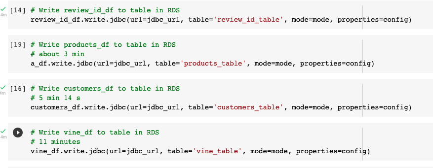
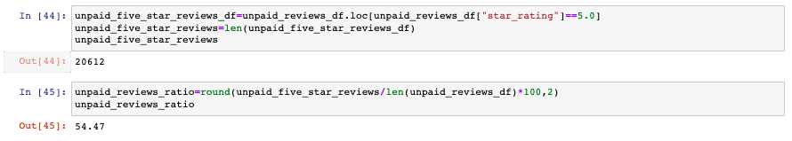

# Amazon_Vine_Analysis
Analyzing Amazon reviews written by members of the paid Amazon Vine program. The Amazon Vine program is a service that allows manufacturers and publishers to receive reviews for their products. 

## Overview

Small companies which sell their products on Amazon pay a small fee to Amazon and product to Amazon vine members to review the product and publish their reviews. This project analyses Amazon reviews of pet products. The dataset is available from [Amazon Review Datasets](https://s3.amazonaws.com/amazon-reviews-pds/tsv/index.txt).

Using Pyspark and data from available datasets, we performed the ETL process. Data is extracted in data frames, performed our transformation steps which include dropping duplicates, various filters, and arithmetic calculations. Then we connected to the AWS RDS instance and loaded the data frames into pgAdmin.

The data from the table which contains all the review information i.e vine_table is extracted from pgAdmin into a CSV file.  In the last, we performed our analysis process on vine data to determine if the Amazon vine program is worth spending money on. For this purpose, we used Jupyter Notebooks and the python pandas library to read data from the CSV file into data frames and performed our analysis process.  

### Data Source
[Pet Products Reviews Data](https://s3.amazonaws.com/amazon-reviews-pds/tsv/amazon_reviews_us_Pet_Products_v1_00.tsv.gz) Dataset

### Tools Used
- Google Colab Notebooks
- PySpark
- Amazon Web Services RDS
- PostgreSQL(pgAdmin)
- Jupyter Notebooks

## ETL Process.

 - Step 1: In pgAdmin, connect to the AWS database.
 
 - Step 2: Create tables to store transformed data.
 
 [Schema](Starter_Code/challenge_schema.sql)
 
 - Step 1: In Google collab notebook, install Pyspark and Postgress drivers that will allow us to interact with Postgress.
 
  
 
 - Step 2: Setting up spark session.
 
   
 
 - Step 3: Loading Amazon data into Spark Dataframes.
 
   
 
 - Step 4: Create various data frames which match our database schema.
 
 - Step 5: Connect to the AWS RDS instance.
 
   
 
 - Step 6: Write each data frame to its table.
 
   

## Analysis Process

Using pgAdmin, we extracted the vine_table into a CSV file and loaded that into a data frame using Jupyter Notebook and pandas library.

We performed filter operations using the loc function and arithmetic operations to calculate the following:

 - 1: Total number of five-star reviews.
 
   

 - 2: Percentage of paid five-star reviews in the vine program.
 
   
 
 - 3: Percentage of unpaid five-star reviews. 
 
   

## Results

Based on the calculations, we conclude that it is not worth spending money on Amazon vine programs as we get more five-star reviews from customers i.e. unpaid. Only 38.24% of paid reviews are five stars. On the other side, more than half of un-paid reviews, i.e. 54.47%, are five-star reviews.

The company should spend this chunk of data on other marketing strategies.

 
 